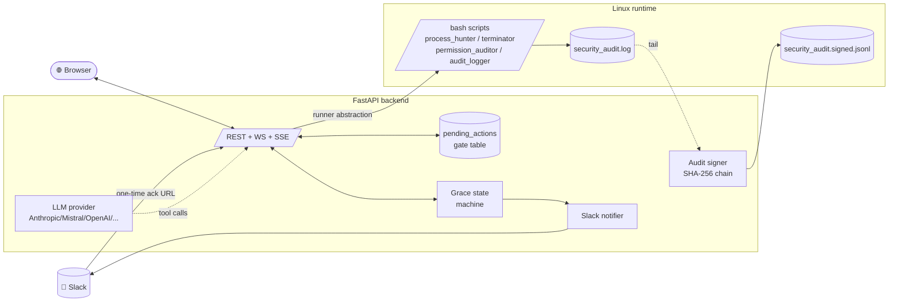

<div align="center">

# 🛡️ Project Aegis

**A Linux shared-server security & resource auditor with a Slack-mediated grace period, a tamper-evident audit log, and a multi-provider LLM copilot.**

[](https://github.com/mazenelnahal11/project-aegis/actions/workflows/ci.yml)


</div>

---

## The 30-second pitch

> Students keep leaving day-long training runs on the shared lab server and `chmod 777`-ing their datasets. **Aegis** finds the offending processes and files, *talks to the human first* over Slack with a 30-minute grace window, and only escalates to a kill after an admin clicks approve. Every action is appended to a **hash-chained, tamper-evident audit log** that anyone can verify with one command. A **Copilot** (Anthropic, Mistral, OpenAI, Groq — anything OpenAI-compatible) can investigate and *propose* actions in plain English; it can never execute them directly.

## Try it in 30 seconds

```bash
git clone https://github.com/mazenelnahal11/project-aegis.git
cd project-aegis
docker compose up --build
# open http://localhost:5173    password: demo
```

A self-contained Linux container spins up with three synthetic rogue processes (`python train.py`, `jupyter-notebook`, `stress-ng`) and a few world-writable files, so the dashboard has something to show on first load.

## Architecture



**Three layers, one invariant:**

| Layer | What it does | Touches the OS? |
|---|---|:-:|
| **Bash scripts** (4 files, unchanged from the OS-lab brief) | Scan processes, terminate, audit permissions, generate reports | ✅ |
| **Backend** (FastAPI) | Orchestration, gating, Slack, hash-chain, LLM tool dispatch | only via the scripts |
| **Frontend** (React + Vite + Tailwind) | Dashboard, confirmation modals, live audit tail, Copilot chat | no |

> **The invariant:** every destructive action — human-initiated, Slack-acknowledged, or LLM-proposed — must pass through a confirmation gate that a logged-in admin clicks "Approve" on. The LLM proposes; humans dispose.

## Highlights

### 💬 Slack grace-period notifier

When Aegis flags a long-running process, it doesn't kill it. It DMs the owner with a 30-minute grace window:

> 🛡️ *Aegis*: Your process **train.py** (PID 4821) has been flagged: 27h runtime, 92% CPU.
> Click here to acknowledge or extend.

The recipient can **STOP** (kill in 6 hours unless extended) or **EXPLAIN** (record a reason, keep running). If they ignore the DM, the grace sweeper escalates to a regular kill gate that still requires admin approval. Most shared-server problems aren't malicious — they're a missing conversation. Aegis has the conversation.

### 🔒 Tamper-evident audit log

Every action lands in `logs/security_audit.signed.jsonl` where each entry's SHA-256 includes the previous entry's hash. Any retroactive edit — rewriting a message, deleting a row, back-dating an insert — fails verification.

```bash
$ python -m app.cli verify-audit
✓ Ledger intact (1,247 entries)

# ...after someone edits one line of the log...
$ python -m app.cli verify-audit
✗ Tampering detected!
  first break at seq #842
  reason: entry_hash mismatch (message or metadata altered)
```

The dashboard shows a live 🔒 / ⚠ badge on the Audit Log page.

### 🤖 Multi-provider LLM Copilot

Set a single env var to swap providers — same tool-use loop, same gate behavior:

| Provider | `AEGIS_LLM_PROVIDER` | `AEGIS_LLM_BASE_URL` | `AEGIS_LLM_MODEL` |
|---|---|---|---|
| Anthropic | `anthropic` | *(blank)* | `claude-sonnet-4-6` |
| Mistral | `mistral` | `https://api.mistral.ai/v1` | `mistral-large-latest` |
| OpenAI | `openai` | `https://api.openai.com/v1` | `gpt-4o` |
| Groq | `groq` | `https://api.groq.com/openai/v1` | `llama-3.3-70b-versatile` |
| Together | `together` | `https://api.together.xyz/v1` | any |

> *"Who is hogging the GPU right now? If anyone's been running for more than 24h, propose warning them."*
>
> The Copilot calls `list_processes`, then `propose_warn_then_kill(pid, reason, grace_minutes)`. A confirmation modal appears. You click Approve. The Slack DM goes out. Nothing else.

### 🧱 Engineering hygiene

- **74 backend tests** (unit + route), Python 3.11/3.12/3.13 matrix, ~95% coverage of new code
- **`shellcheck`** on every shell script in CI
- **`ruff`** clean, **TypeScript `strict`** clean
- **`docker compose build`** as a CI step so nobody ships a broken image
- All destructive operations go through `argv`-only subprocess calls — no `shell=True` anywhere

## Run it for real

The Docker demo is great for browsing. For real shared-server use, drop the `LocalRunner` against a Linux host:

```bash
# On the Linux shared server
git clone https://github.com/mazenelnahal11/project-aegis.git /opt/aegis
cd /opt/aegis/backend
cp .env.example .env

# Generate an admin password hash + JWT secret
python -m app.cli hash-password >> .env   # appends AEGIS_ADMIN_PASSWORD_HASH
python -c "import secrets; print(f'AEGIS_JWT_SECRET={secrets.token_urlsafe(48)}')" >> .env

# Optional: paste in AEGIS_SLACK_WEBHOOK_URL and AEGIS_LLM_API_KEY

pip install -e .
uvicorn app.main:app --host 0.0.0.0 --port 8000

# Frontend (build once, then serve dist/ from any static server / nginx)
cd ../frontend && npm install && npm run build
```

A cron job can drive the canonical batch pipeline alongside the web UI:

```cron
0 * * * *  cd /opt/aegis && ./aegis_master.sh >> /var/log/aegis.log 2>&1
```

The web dashboard reads the same `security_audit.log` and signs every new line.

## What's where

| Concern | File |
|---|---|
| Bash pipeline (unchanged) | [scripts/](scripts/) + [aegis_master.sh](aegis_master.sh) |
| WSL/Linux shell bridge | [backend/app/runners/](backend/app/runners/) |
| Confirmation gate table + executor | [backend/app/gates.py](backend/app/gates.py) |
| Slack grace state machine | [backend/app/grace.py](backend/app/grace.py) |
| Slack notifier | [backend/app/notifiers/slack.py](backend/app/notifiers/slack.py) |
| Hash-chained audit signer | [backend/app/audit_signer.py](backend/app/audit_signer.py) |
| LLM provider abstraction | [backend/app/llm/providers/](backend/app/llm/providers/) |
| LLM tool schemas (security boundary) | [backend/app/llm/tools.py](backend/app/llm/tools.py) |
| Confirmation modal | [frontend/src/components/ConfirmGateModal.tsx](frontend/src/components/ConfirmGateModal.tsx) |
| Integrity badge | [frontend/src/components/IntegrityBadge.tsx](frontend/src/components/IntegrityBadge.tsx) |
| Copilot chat UI | [frontend/src/pages/Copilot.tsx](frontend/src/pages/Copilot.tsx) |
| CI workflow | [.github/workflows/ci.yml](.github/workflows/ci.yml) |

## CLI

```bash
python -m app.cli verify-audit    # walk the signed ledger, exit 2 on tamper
python -m app.cli hash-password   # bcrypt hash a password (stdin prompted)
```

## Tests

```bash
cd backend
pip install -e ".[dev]"
pytest                   # 74 tests, fully mocked, no WSL/Slack/LLM keys needed
ruff check app tests
```

## Design principles

1. **Bash scripts are immutable.** The original four scripts from the OS-lab brief stay as they are. The Python and React layers wrap them — they never replace them, never invoke them via `bash -c` with interpolation, never short-circuit them when a fancier path exists.
2. **Argv only — no shell strings.** Every `subprocess` call uses an argv list. No `shell=True`, no template-interpolated commands. Path inputs to `chmod` are validated against a strict regex and reject `..`.
3. **Humans approve destructive actions.** Every kill and chmod goes through `pending_actions` and requires a fresh admin click. The LLM never bypasses this; the Slack grace flow just adds a polite delay.
4. **The audit log is the source of truth.** The dashboard, the LLM, and the Slack notifier all read and append to the same `security_audit.log` the bash scripts produce. The signed ledger is a parallel cryptographic record, not a replacement.
5. **Providers are config, not code.** Swap Anthropic ↔ Mistral ↔ OpenAI ↔ Groq with two env vars. The chat loop, the tool schemas, and the system prompt are all provider-agnostic.

## License

MIT. Originally a coursework project for the **Operating Systems lab at Badya University**, since extended into a portfolio piece.

---

<div align="center">

Built by [@mazenelnahal11](https://github.com/mazenelnahal11) and team.
Powered by FastAPI, React, Tailwind, Anthropic Claude / Mistral / OpenAI, Vite, and a refusal to call `shell=True`.

</div>
